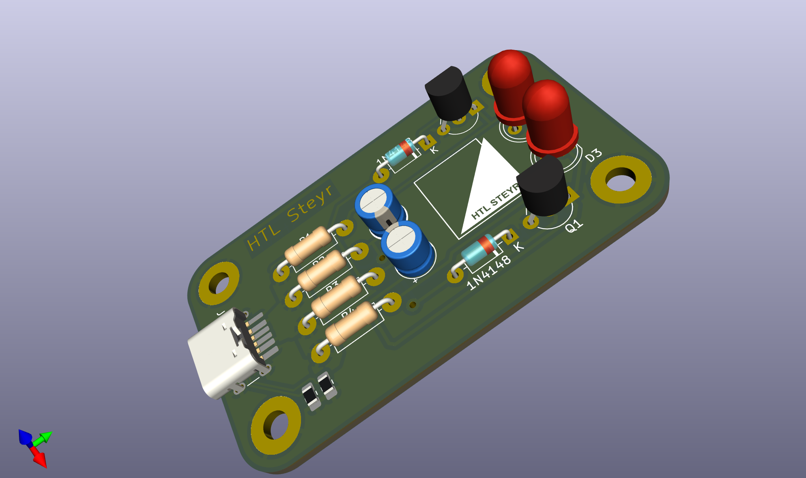
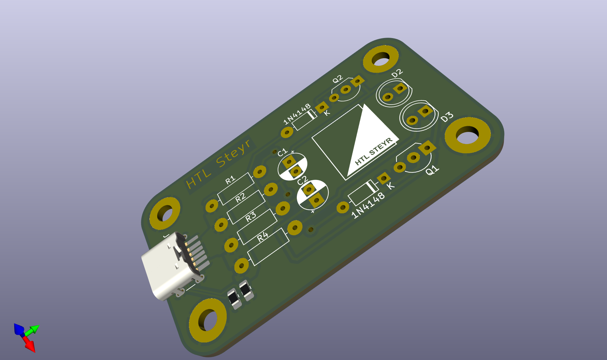

# Schnupperblinki_USB-C
 Schnupperübung für die Schupperschüler

 
 ## Bilder

## Bestückplan

[BOM](http://htmlpreview.github.io/?https://github.com/GerritMihu/Schnupperblinki_USB-C/bom/Blinki mit USB-C-ibom.html)
